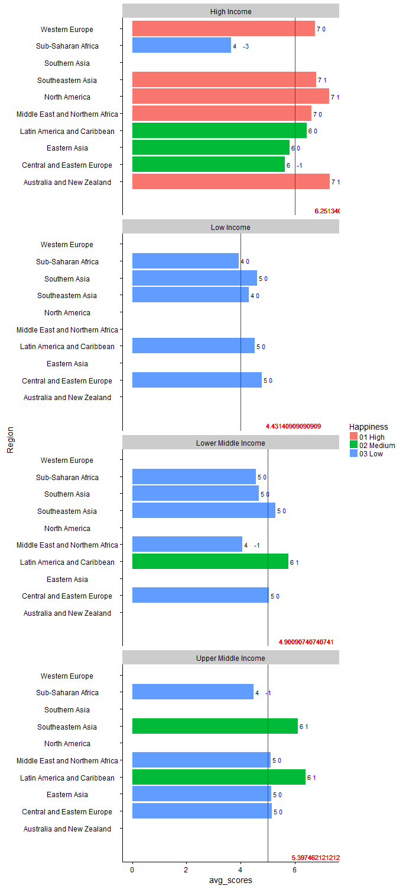
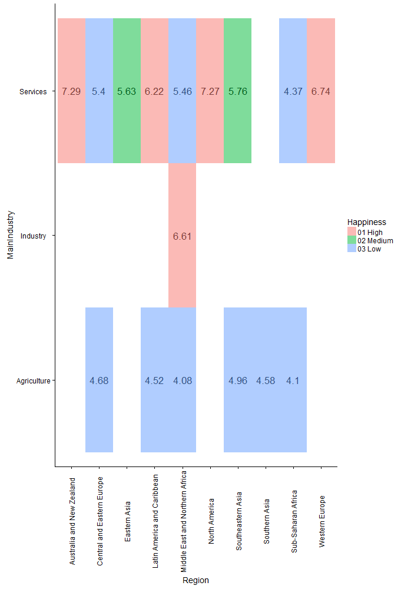

#**Introduction**
This project shows interesting findings about the correlation between happiness (rated on a scale from 1-10) and its relationship between various employment sectors in countries around the world. 

Our data was supplied from the [International Labour Organization](http://www.ilo.org/global/research/global-reports/global-employment-trends/2014/WCMS_234879/lang--en/index.htm), [Kaggle](https://www.kaggle.com/unsdsn/world-happiness),
[UN](http://www.un.org/en/development/desa/policy/wesp/wesp_current/2014wesp_country_classification.pdf), [Google Developers](https://developers.google.com/public-data/docs/canonical/countries_csv), and [World Bank](http://data.worldbank.org/indicator/SP.POP.TOTL)

The international Labour Organization website provided us the datasets for Employment by Sector and Status in Employment. Using the data.world query functions, we subset the data from the year 2012 for both of these and joined them together. 

Kaggle provided the World Happiness data. This dataset gives a rank by happiness for each country, the region in which the country is in, and a happiness score. The scores are based on the answer to a question asked in the Gallup World Poll. Quoting from Data.World, "This question, known as the Cantril ladder, asks respondents to think of a ladder with the best possible life for them being a 10 and the worst possible life being a 0 and to rate their own current lives on that scale."

We needed one more categorical variable but could not find any suitable datasets. The UN report on "Country Classification" gave a list of countries determined to be in a category of either: Low Income, Lower Middle Income, Upper Middle Income, High Income. There was not an easily downloadable CSV for this so we created one in Excel. This was not run through an ETL file as there was nothing to clean up as it was only two columns - Country and Income Class. We joined this dataset with the joined employment dataset. 

The Google Developers site provided the longitude and latitude data for each country; we then joined this dataset with the previously joined dataset from above. 

Finally, to make the data more readable and create a calculated field that calculates the percentage in each sector (Agriculture, Industry, and Service), we had to find the population data for each country. This came form the World Bank website. This dataset was, again, joined with the dataset that has all the other joins. 

Our final join was combining the dataset that had all of the above with the World Happiness datset. This was accomplished through an outer join, linking by Country name. 

All joins were completed in data.world, with one exception. We joined the World Happiness dataset with the large conglomeration above in Tableau as well. 

Below we display our sessionInfo().

```{r sessionInfo}
sessionInfo()
```

#**The Data**


*Cleaning Up World Happiness Dataset*

This data was not difficult to clean up and remained largey untouched. 

```{r}
source("../01 Data/R_ETL_World_Happiness.R")
```

*Cleaning Up Joined Employment Dataset*
This dataset also did not require a lot of cleaning; the joining and subsetting happened in Data.World. There were no commas, strange column headings, etc.
```{r}
source("../01 Data/R_ETL_GET_status_sector_2012.R")
```


#**The Visualizations**
##*Scatterplot*
<b>Tableau Version</b>
<center></center>
<b>Shiny Version</b>
<center></center>
These visualizations shows that as GDP increases, so does happiness. We also get an indication of the trend of each region in happiness; for example, Australia and New Zealand have a pretty horizontal line. As only two countries are involved, it shows that the disaparity between the two is not high; GDP and Happiness are quite similar for Australia and New Zealand. We also see clustering of countries in the Sub-Saharan Africa region with low happiness scores and low GDPs. Western Europe is on the opposite end of this spectrum with high happiness scores and high GDPs, though there is a fairly large disparity between the happiest country in Europe and the least happy based on the trend line. 


##*Boxplot*
<b>Tableau Version</b>
<center></center>
<b>Shiny Version</b>
<center></center>

These visualizations show that Sub-Saharan Africa  has both the largest percentage of people working in the Agriculture sector and the highest variance of those working in this sector. High income regions such as North America, Western Europe, and Australia and New Zealand have the least variance within each group. Also, the sector with the largest percentage of people working within it for these countries is the Services sector with very few working in the Agriculture sector. The Middle East and Africa has large variance within each group.

##*Barchart*
<b>Tableau Version</b>
<center></center>
<b>Shiny Version</b>
<center></center>


The barcharts show us that Sub-Saharan Africa is the least happy within each Income Class. Overall, Australia and New Zealand are the happiest. The line shows us the average happiness score of the region. Latin America and the Caribbean are the happiest for both the Upper Middle Income and Lower Middle Income. 

##*Crosstabs*
<b>Tableau Version</b>
<center></center>
<b>Shiny Version</b>
<center></center>

In this visualization, things are a little reversed; as we are averaging the happiness rank, a higher rank means that a country/region is less happy on a whole. Each number is the average happiness of the countries who are in this region and whose main sector it is either industry, agriculture, or services. The sector with the lowest happiness score, on average, are the companies whose largest sector is agriculture.  The only region that has a country whose main sector is Industry is the Middle East/North Africa. 

##*Map*
<b>Tableau Version</b>
<center></center>
<b>Shiny Version</b>
<center></center>

The maps provide shows that the regions of Africa and parts of the Middle East, Eastern Europe, and SouthEastern Asia are the least happy. Northern Europe, most of South America, and North America are largely happy. In the Shiny app you can hover over each marker to find the country and then select the marker to view the country's happiness rank and score.


